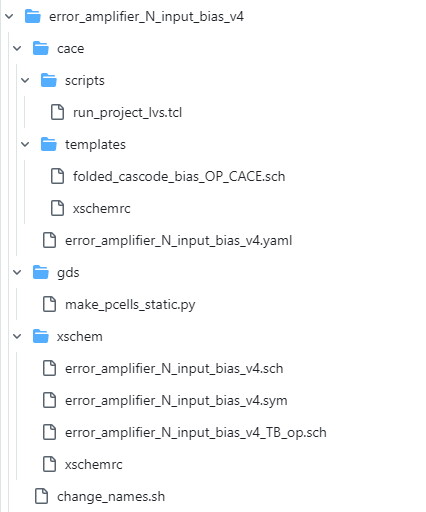
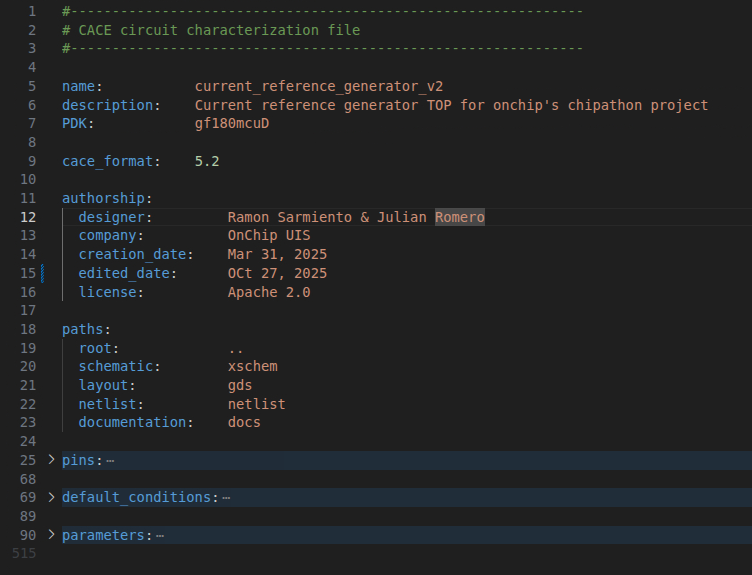
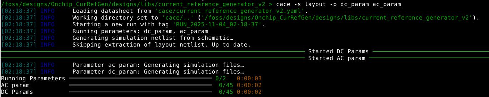

# Design Characterization with CACE: From Schematic to Post-Layout 

This README outlines the process for verifying circuit designs using **CACE** (Cadence Automated Circuit Evaluation). CACE allows for automated simulations and analysis to validate the characteristics and specifications of electronic designs before physical implementation.

## Prerequisites
It is necessary to clone the repository directly into the /foss/designs directory within the Docker container.

## Project Structure
All directories, schematics, templates, testbenches, etc., of the main project are located in the directory `Onchip_CurRefGen/designs/libs/`. The project has the following hierarchical structure.

```
Current Reference Generator
|---Error Amplifier N_input
|   |---Error Amplifier N_input core
|   |---Error Amplifier N_input bias
|---Current Reference Second Stage
Current Reference Load
```

## CACE Structure
Below is a brief description of a basic CACE structure to perform all the relevant measurements for the project and the use of the GF180 PDK. The complete CACE documentation can be found at the following [link](https://cace.readthedocs.io/en/latest/).

```
cace            # CACE datasheet (.yaml), templates, scripts
|---scripts     # Useful scripts for post-simulation processing, LVS, etc.
|---templates   # Templates for running the parameters
gds             # Project layout and a script to flatten the layout
xschem          # Schematic, symbol designs, and all pre-layout testbenches
```

Certain files have naming restrictions. The .yaml, .sch, .sym, and .gds files must have the same name as the project directory. For example, for the project `error_amplifier_N_input_v4,`, the following files must exist with the corresponding names: `error_amplifier_N_input_v4.yaml`, `error_amplifier_N_input_v4.sch`, `error_amplifier_N_input_v4.sym`, and `error_amplifier_N_input_v4.gds`, each placed in its respective folder according to the previously mentioned structure. Testbenches, scripts, and templates do not need to follow the same naming convention for their files.



## Run the characterizations

All project description is contained in the `.yaml` file, as it serves as the datasheet. It includes general project information such as the name, description, PDK used, pins, authorship, paths to various files, default conditions for each pin, measurement parameters, simulation conditions, and more. This file will generate all documentation at the end of its execution. To run CACE, the following command must be executed in the project's folder:

```
> cace
```

This will execute all the parameters specified in the datasheet for the extraction of capacitances and parasitic resistances of the project (rcx), including all corners, stimuli, Monte Carlo points, among other conditions. To execute specific parameters, the `-p [parameter]` option should be added, and the parameters to be evaluated must be defined. To change the netlist on which the measurement will be performed, the `-s [source]` option must be used, with options such as `schematic`, `layout`, and `rcx`. For example:

```
> cace -s layout -p dc_param ac_param
```



